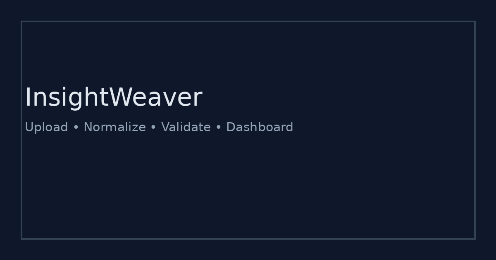

# InsightWeaver (Financial Data Extraction and Dashboarding Suite)


A deployable MVP that turns messy finance exports (CSV, Excel, JSON) into **analytics-ready datasets** and a **dashboard preview**.

**Portfolio-safe:** this is an original MVP codebase (not internship code) you can publish on GitHub.

---

## What problem does it solve?

### Pain points
- Finance data arrives in inconsistent formats (Sheets, Excel, JSON exports).
- Manual cleaning is slow and error-prone (dates, currency, column names).
- Duplicates and missing values silently break dashboards and reports.

### What InsightWeaver does
- Ingests multiple formats and infers schema.
- Normalizes columns, dates, and amounts.
- Deduplicates rows and runs validations.
- Produces exports you can plug into BI tools.

---

## Screenshots

> Placeholders in `assets/` (replace with real screenshots later).




---

## Outputs

For each run you get:
- `normalized.csv`
- `schema.json`
- `validation.json`
- `report.json`

---

## Quickstart

### Option A: Docker (fastest)
```bash
docker compose up --build
# open http://localhost:8000
```

### Option B: Local
```bash
python -m venv .venv
source .venv/bin/activate
pip install -r requirements.txt
uvicorn app.main:app --reload --port 8000
```

---

## Demo mode (no upload required)

Use the built-in sample dataset:
- Open the UI
- Click **Run Sample Dataset**
- View schema, validations, dashboard, and exports

---

## How it works (pipeline)

1. **Ingest**
   - CSV / XLSX / JSON
2. **Schema inference**
   - types, null rates, examples
3. **Normalization**
   - snake_case columns, date parsing, currency parsing, trimming
4. **Deduplication**
   - uses `transaction_id` if present, otherwise row hash
5. **Validation**
   - negative amounts, future dates, high missing rate, outliers
6. **Dashboard**
   - category breakdown + time trend + summary stats

---

## Repo structure

```
insightweaver-ai/
  app/
    main.py               # FastAPI routes
    core/
      io.py               # loaders
      schema.py           # inference
      normalize.py        # normalization
      dedupe.py           # deduplication
      validate.py         # validation rules
      dashboard.py        # chart helpers
      store.py            # run registry
    templates/            # UI pages
    static/               # styles + JS
  sample/                 # sample finance file
  assets/                 # README screenshots (placeholders)
  docker-compose.yml
  Dockerfile
```

---

## Suggested commit history

1. `chore: bootstrap app + upload UI`
2. `feat: schema inference`
3. `feat: normalization + exports`
4. `feat: dedupe + validation rules`
5. `feat: dashboard preview`
6. `chore: docker + docs + ci`

---

## License
MIT (see `LICENSE`).
